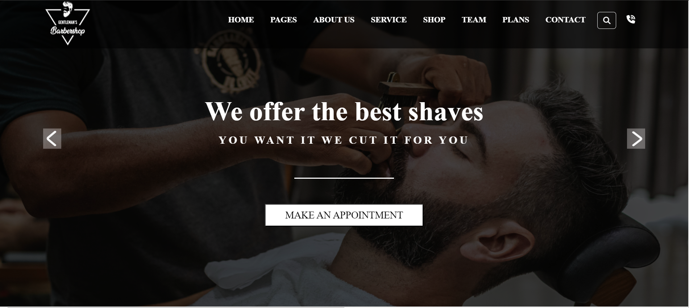
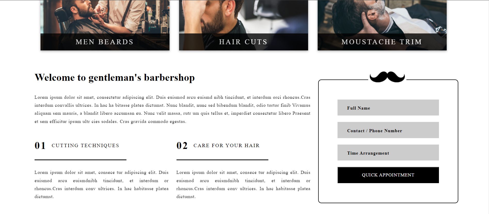
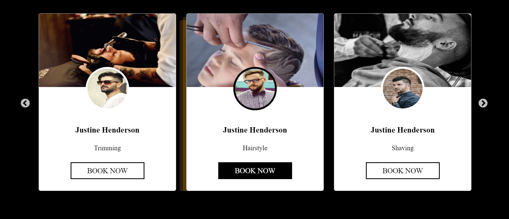

# Gentlemen Barber Website

## Description
This website is a fictional barber shop designed for a modern and sleek look. It features smooth animations on scroll using AOS, a responsive design using Bootstrap, and a slick image slider.

## Deployment
The website is deployed and can be viewed at [Gentlemen Barber Website](https://manthanthakor.github.io/Barbar-shop/).

## Technologies Used
- HTML
- CSS
- Bootstrap
- AOS (Animation on Scroll)
- Slick Slider

## Features
- Responsive design for mobile and desktop views.
- Smooth animations on scroll for enhanced user experience.
- Image slider to showcase services or portfolio.

## Usage
1. Clone the repository:
git clone https://github.com/ManthanThakor/Barbar-shop.git

2. Navigate into the project directory:
3. Open `index.html` in your web browser.

## Screenshots

<!-- Add more screenshots if necessary -->

## Contributing
Contributions are welcome. Feel free to fork the repository and submit pull requests.

## License
This project is licensed under the MIT License. See the LICENSE file for more details.
